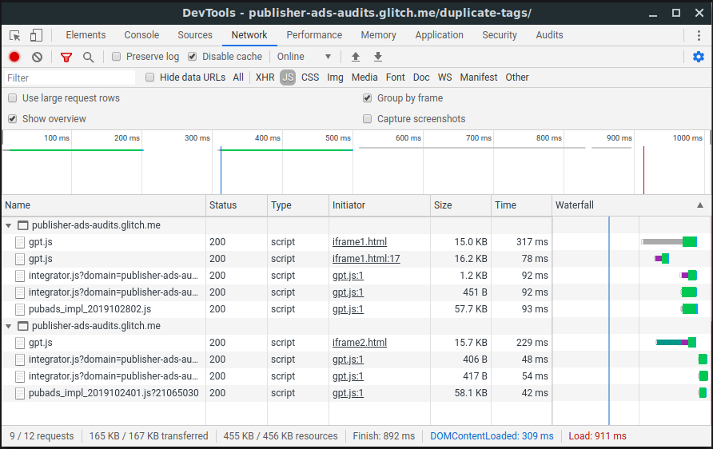

# Load tags only once per frame

## Overview

This audit ensures that no frames load the same ad tag library script more than
once. Including the same script multiple times is unnecessary and can lead to
decreased page performance.

## Recommendations

Remove duplicate ad tag library scripts. In some cases, duplicate scripts can be
unknowingly loaded from two different locations. Examine where each duplicate
script is coming from by reviewing network traffic and grouping requests by
frame.

### Identify the source of duplicate scripts

Use the Network tab in Chrome DevTools to determine which frame is loading duplicate scripts.

1. Open DevTools by pressing `Control+Shift+J` or `Command+Option+J` (Mac).
2. Navigate to the **Network** tab.
3. If not already visible, click **Filter**
    to open the filter bar and select
   **JS**.
4. Open **Network Settings**
    and select
   **Group by frame**.
5. Reload the page to capture network traffic.

## More information

The following ad tag library scripts are supported:

<table>
  <tr>
    <th>Library</th>
    <th>Script(s)</th>
  </tr>
  <tr>
    <td>AdSense</td>
    <td>
      
<code>pagead2.googlesyndication.com/pagead/js/adsbygoogle.js</code>

      
<code>pagead2.googlesyndication.com/pagead/js/show_ads.js</code>

    </td>
  </tr>
  <tr>
    <td>Google Publisher Tag</td>
    <td>
      
<code>googletagservices.com/tag/js/gpt.js</code>

      
<code>securepubads.g.doubleclick.net/tag/js/gpt.js</code>

    </td>
  </tr>
</table>
