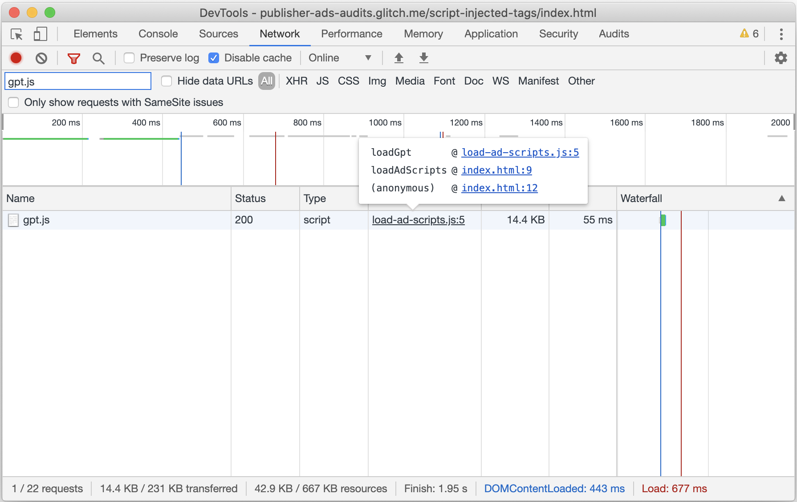

# Load ad scripts statically

## Overview

This audits checks whether or not ad scripts are being injected into the page.
Other resources on the page may delay the fetching and loading of injected
scripts, which will in turn delay the loading of ads. In some situations these
scripts may not be fetched at all, preventing ads from being loaded all
together.

## Recommendations

Load scripts via async script tags to improve speed. The browser preload scanner
can fetch script tags earlier, even if render blocking resources are blocking
the script execution.

<table class="details responsive">
  <tr>
    <td><strong>Incorrect</strong></td>
    <td>
<pre class="prettyprint lang-html">&lt;script&gt;
  var el = document.createElement('script');
  el.src = 'https://securepubads.g.doubleclick.net/tag/js/gpt.js';
  var node = document.getElementsByTagName('script')[0];
  node.parentNode.insertBefore(el, node);
&lt;/script&gt;</pre>
    </td>
  </tr>
  <tr>
    <td><strong>Correct</strong></td>
    <td>
<pre class="prettyprint lang-html">&lt;script async src="https://securepubads.g.doubleclick.net/tag/js/gpt.js"&gt;&lt;/script&gt;</pre>
    </td>
  </tr>
</table>

### Identify the source of injected ad scripts

Sometimes it may not be obvious how an ad script is being injected into a page,
or even that it's being injected at all. For example, when examining the source
of a page after it's loaded, a script tag that has been injected may appear
indistinguishable from a tag that was loaded statically.

In these cases, use the Network tab in Chrome DevTools to determine the source
of injected ad scripts.

1. Open DevTools by pressing `Control+Shift+J` or `Command+Option+J` (Mac).
1. Navigate to the **Network** tab.
1. If not already visible, click **Filter**
    to open the filter bar and type the
   name of the script flagged by this audit into the text box.
1. If not already visible, right-click on any table header and select
   **Initiator** to include the Initiator column in the network request
   waterfall table.
1. Reload the page to capture network traffic.

As seen in the above screenshot, the initiator column will contain information
about the source of the script in question. You can click on the source link to
jump directly to the code responsible for issuing the ad script request, or
hover over the source link to see all of the calls leading up to the request.

## More information

This audit operates against a whitelist of ad scripts which are known to be safe
to load statically. The current list is:

<table>
  <tr>
    <th>Library</th>
    <th>Script(s)</th>
  </tr>
  <tr>
    <td>AdSense</td>
    <td>
      <code>pagead2.googlesyndication.com/pagead/js/adsbygoogle.js</code>
    </td>
  </tr>
  <tr>
    <td>Amazon Publisher Services</td>
    <td>
      <code>amazon-adsystem.com/aax2/apstag.js</code>
    </td>
  </tr>
  <tr>
    <td>Criteo Direct Bidder</td>
    <td>
      <code>static.criteo.net/js/*/publishertag.js</code>
    </td>
  </tr>
  <tr>
    <td>Google Publisher Tag</td>
    <td>
      
<code>googletagservices.com/tag/js/gpt.js</code>

      
<code>securepubads.g.doubleclick.net/tag/js/gpt.js</code>

    </td>
  </tr>
  <tr>
    <td>Index Exchange</td>
    <td>
      <code>js-sec.indexww.com/ht/p/*.js</code>
    </td>
  </tr>
</table>

[Intervening against document.write()](https://developers.google.com/web/updates/2016/08/removing-document-write)  
[Script-injected "async scripts" considered harmful](https://www.igvita.com/2014/05/20/script-injected-async-scripts-considered-harmful/)
